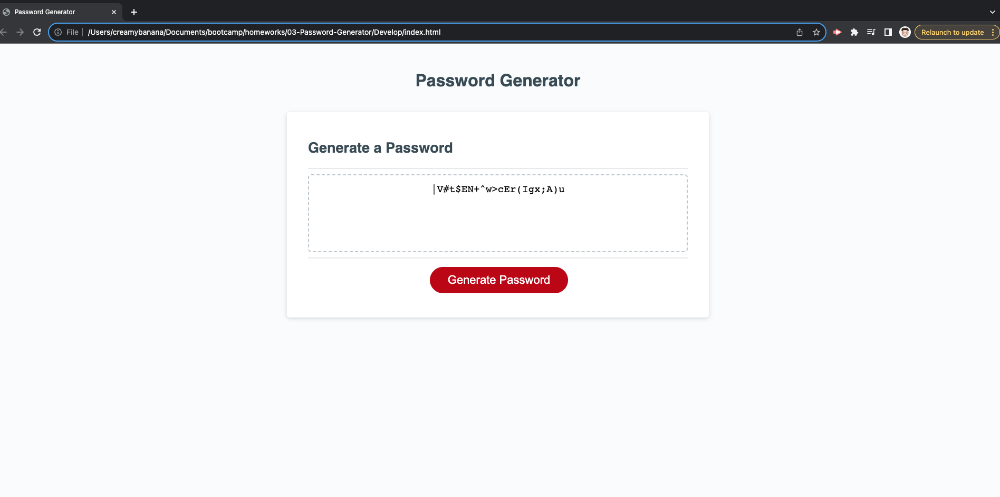
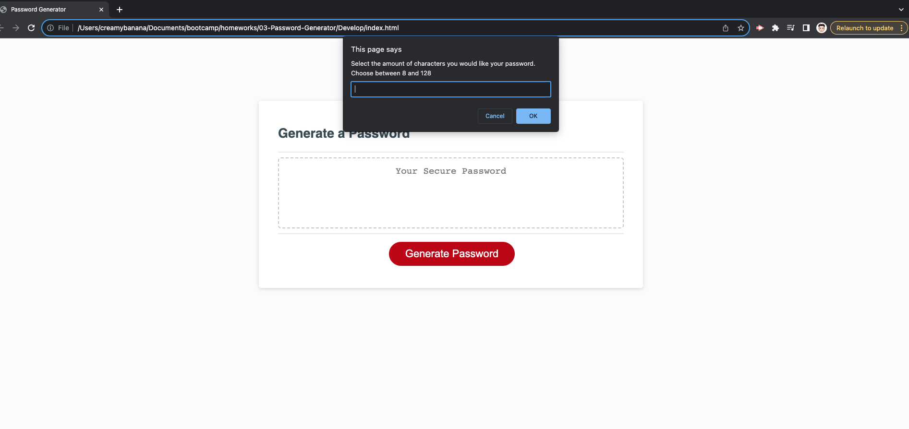
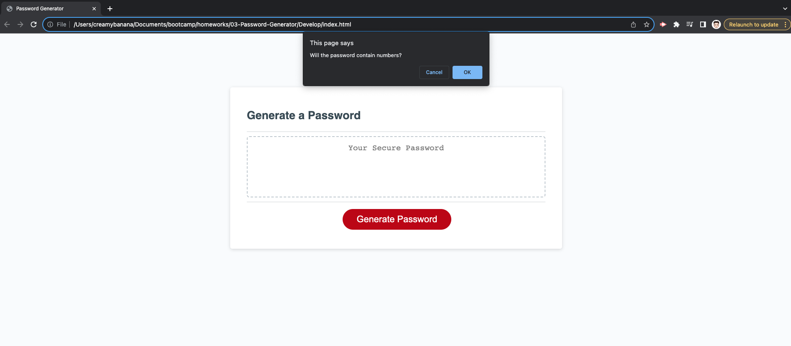

## 03 JavaScript: Password Generator

* [Github Repository](https://github.com/KrispyKhang/Khangs-Password-Generator)
* [Deployed Github](https://krispykhang.github.io/Khangs-Password-Generator/)



## Task
This week's Challenge requires you to modify starter code to create an application that enables employees to generate random passwords based on criteria that they’ve selected. This app will run in the browser and will feature dynamically updated HTML and CSS powered by JavaScript code that you write. It will have a clean and polished, responsive user interface that adapts to multiple screen sizes.

## User Story

```
AS AN employee with access to sensitive data
I WANT to randomly generate a password that meets certain criteria
SO THAT I can create a strong password that provides greater security
```

## Acceptance Criteria

```
GIVEN I need a new, secure password
WHEN I click the button to generate a password
THEN I am presented with a series of prompts for password criteria
WHEN prompted for password criteria
THEN I select which criteria to include in the password
WHEN prompted for the length of the password
THEN I choose a length of at least 8 characters and no more than 128 characters
WHEN asked for character types to include in the password
THEN I confirm whether or not to include lowercase, uppercase, numeric, and/or special characters
WHEN I answer each prompt
THEN my input should be validated and at least one character type should be selected
WHEN all prompts are answered
THEN a password is generated that matches the selected criteria
WHEN the password is generated
THEN the password is either displayed in an alert or written to the page
```

## Summary
* HTML, CSS, & Javascript were used to create this Password Generator Site.
* This module 3 assignment emphasizes the use case of Javascript on making a webpage have purpose and function.
* See screenshots below for the finished product.

## Features
 * A Generate button:
    * Once clicked, it will pop up a series of prompts.
    * A random password will be generated after the user data is collected using Javascript.



 * Prompt pop up:
    * A series of prompts will pop up asking users the number of characters in their passwords
    that they want ranged from 8 to 128 characters.
    * Then followed by prompts to see if users want special characters, lowercase, uppercase, and/ or numbers in the password.



 * Ta-da! Password is generated based on user preference.


